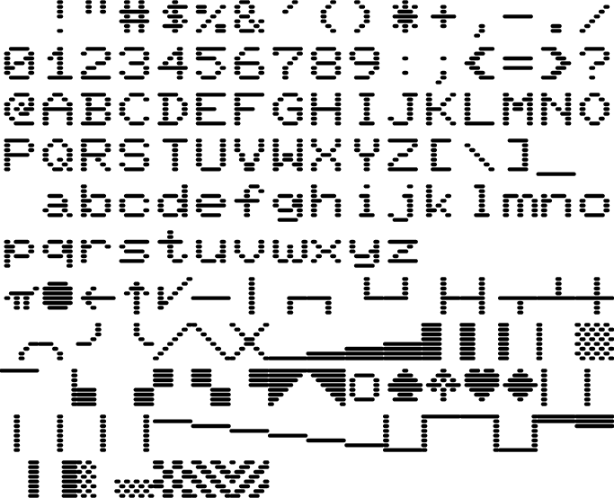

# Transactor fonts

Dot-matrix style fonts, using the patterns from the Commodore CBM/PET character generator ROM.

Hurriedly hacked together from my other font, [Quantum](https://github.com/FriedOrange/Quantum-font); see that repo for technical details.

The PETSCII characters use the same Unicode encodings as [Rebecca Bettencourt&rsquo;s Pet Me fonts](https://www.kreativekorp.com/charset/map/petscii/).